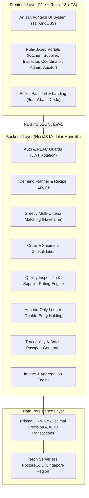

<div align="center">

# 🌾 ORVANA
### *Agri-Food Supply Chain Engine for Mass Nutritional Kitchens*

[-1E3A2F?style=for-the-badge&logo=jest&logoColor=white)](https://github.com/YogUNI/orvana)
[](https://www.typescriptlang.org/)
[](https://nestjs.com/)
[](https://react.dev/)
[](https://www.prisma.io/)
[](https://neon.tech/)
[](LICENSE)

<br/>

**ORVANA** menghubungkan **kebutuhan pangan terjadwal** dapur gizi massal (program makan bergizi, asrama, dan katering skala besar) secara presisi dengan **rencana panen** petani, peternak, dan nelayan lokal di sekitarnya. 

Dilengkapi dengan **algoritma pencocokan multi-kriteria (Haversine)**, **kontrol mutu bertingkat (QC)**, **buku besar pembayaran bertahap (escrow-style ledger)**, serta **paspor pangan digital (QR batch traceability)** yang dapat diverifikasi publik secara transparan.

[Jelajahi Demo](#-skenario-inti-demo-alur-p0) • [Arsitektur Sistem](#-arsitektur--teknologi) • [Instalasi Lokal](#-panduan-instalasi--menjalankan-aplikasi) • [Struktur Repositori](#-struktur-repositori) • [Metrik Dampak](#-9-metrik-dampak-orvana)

---

</div>

<br/>

## 🎯 Mengapa ORVANA?

Program pemenuhan gizi massal membutuhkan pasokan bahan pangan segar dalam jumlah masif, berkesinambungan, dan terstandar mutu tinggi. Namun di lapangan, rantai pasok pangan tradisional menghadapi 4 jurang sistemik:

```
┌────────────────────────────────────────────────────────────────────────┐
│                          TANTANGAN TRADISIONAL                         │
├────────────────────────────────────────────────────────────────────────┤
│ 1. Asimetri Informasi : Dapur gizi kekurangan bahan, petani kebingungan│
│                         menjual hasil panen di sekitarnya.             │
│ 2. Rentenir & Tengkulak: Rantai distribusi 4-6 lapis menekan harga     │
│                         produsen dasar hingga ke titik nadir.          │
│ 3. Asal Bahan Gelap   : Sulit melacak dari ladang mana bahan berasal   │
│                         saat terjadi insiden keamanan pangan / mutu.   │
│ 4. Transparansi Dana  : Ketiadaan rekonsiliasi audit publik atas arus  │
│                         anggaran belanja pangan lokal.                 │
└────────────────────────────────────────────────────────────────────────┘
```

### 💡 Solusi & Keunggulan ORVANA
- **Bukan Sekadar E-Commerce / Marketplace**: Sistem berbasis *Demand-Driven Scheduled Matching*. Dapur menyusun menu dan porsi $\rightarrow$ sistem mengonversi otomatis ke gramatur komoditas $\rightarrow$ dicocokkan ke kalender panen lokal jauh-jauh hari.
- **Proteksi Harga Dasar (*Price Floor Enforcement*)**: Permintaan dapur yang menawar di bawah batas kelayakan harga petani (*floor price*) otomatis ditolak oleh sistem.
- **Transparansi Bertingkat & UU PDP**: Konsumen dan auditor dapat memindai QR batch untuk menelusuri riwayat komoditas dari ladang hingga ke meja saji, dengan proteksi identitas privat sesuai UU Perlindungan Data Pribadi.

---

## 🏛️ Arsitektur & Teknologi

Sistem dibangun menggunakan pendekatan arsitektur monolit modular berlapis (*Clean Modular Architecture*) dengan jaminan type-safety hulu-ke-hilir (*End-to-End Type Safety*).



### Tech Stack Spesifikasi
| Lapisan | Komponen & Pustaka | Rationale |
|:---|:---|:---|
| **Frontend** | React 18, Vite, TypeScript | Rendering instan, type-safe components |
| **Styling** | Tailwind CSS + Custom Typography | Desain orisinal *Artisan Agritech* (Newsreader, JetBrains Mono, Warm Stone) |
| **State & Query** | TanStack Query v5 + React Hook Form + Zod | Cache management, optimistic update, declarative form validation |
| **Visualisasi** | Recharts & React-Leaflet | Visual grafik metrik & pemetaan GIS koridor pasokan interaktif |
| **Backend** | NestJS (Node.js 20+ TypeScript) | Enterprise architecture, Dependency Injection, class-validator, Swagger OpenAPI |
| **ORM & Database**| Prisma 6.x + PostgreSQL 16 (Neon Cloud) | ACID `$transaction`, `Decimal(14,0)` rupiah presisi tanpa floating point error |
| **Security** | JWT Dual-Token (15m Access + 7d Refresh), Bcrypt, Scoped RBAC | Autentikasi ketat 6 peran + mitigasi tampering |
| **Testing** | Jest (19 Suites / 99 Unit Tests lulus 100%) | Pengujian terisolasi rumus matematika pencocokan, ledger, dan metrik dampak |

---

## 👥 6 Peran Pengguna + Portal Publik

ORVANA memisahkan hak akses dan data isolation (*Row-Level Scoping*) secara ketat untuk setiap pemangku kepentingan:

| Peran | Ikon | Tugas Utama di ORVANA |
|:---|:---:|:---|
| **Admin Dinas** | 🏛️ | Mengelola master komoditas, ambang harga acuan & batas bawah, verifikasi entitas, monitoring wilayah, dan adjudikasi sengketa pasokan. |
| **Pengelola Dapur** | 🍳 | Merencanakan menu harian, menentukan jumlah porsi, mempublikasikan permintaan bahan (*demand*), dan memantau status serah terima. |
| **Produsen / Petani** | 🌱 | Memasukkan kalender panen, menerima/menolak alokasi pesanan otomatis, memonitor penahanan & pencairan saldo pembayaran. |
| **Koordinator / Pengepul**| 🚚 | Mengonsolidasikan komoditas dari petani-petani sekitar ke dalam armada logistik dan mencetak manifes pengiriman terintegrasi. |
| **Pengawas Mutu (QC)** | 🔬 | Memeriksa fisik bahan di gerbang dapur berdasarkan lembar uji terstandar, menetapkan status kelolosan (PASS, PARTIAL, REJECT), dan memicu pelepasan dana ledger. |
| **Auditor Publik** | 📋 | Memeriksa keabsahan rantai transaksi, kepatuhan alokasi belanja lokal, riwayat ledger append-only, dan log aktivitas audit. |
| **Masyarakat Umum** | 🔍 | Portal publik tanpa login (`/trace/:batchCode`) untuk membaca paspor pangan asal usul bahan makanan anak sekolah/massal. |

---

## ⚙️ Logika Bisnis & Formula Inti

Semua kalkulasi di ORVANA berpatokan teguh pada aturan bisnis di `docs/04-business-rules.md`:

### 1. Perencanaan Kebutuhan Bahan (*Demand Calculation*)
$$\text{BaseQty}(c, d) = \sum (\text{Portions} \times \text{QuantityPerPortion}(c))$$
$$\text{NeedQty}(c, d) = \text{BaseQty}(c, d) \times \left(1 + \frac{\text{WastePercent}(c)}{100}\right) \quad \text{[Dibulatkan ke atas 0.1 kg]}$$

### 2. Multi-Criteria Matching Score
Algoritma alokasi mencari skor tertinggi pemasok menggunakan 5 parameter terbobot:
$$\text{Score} = (0.30 \times S_{\text{distance}}) + (0.30 \times S_{\text{quality}}) + (0.20 \times S_{\text{price}}) + (0.10 \times S_{\text{freshness}}) + (0.10 \times S_{\text{reliability}})$$
- **Distance Score**: Dihitung dengan rumus *Haversine Spherical Distance* (maksimum radius 50 km).
- **Anti-Monopoli (*Fair Allocation*)**: Satu pemasok dibatasi maksimal memasok 60% kuantitas dari satu permintaan dapur gizi.

### 3. Mutu & Exponential Moving Average (EMA)
Reputasi mutu pemasok diperbarui secara otomatis setiap kali hasil inspeksi QC dirilis ($\alpha = 0.2$):
$$\text{QualityScore}_{\text{new}} = (0.8 \times \text{QualityScore}_{\text{prev}}) + (0.2 \times \text{QCResultScore})$$

### 4. Pembayaran Bertahap (*Append-Only Double Entry Ledger*)
```
[Order Disetujui] ──> HOLDING (Dana Dapur Ditahan)
                          │
         ┌────────────────┴────────────────┐
         ▼                                 ▼
   [QC: Lolos]                       [QC: Tolak/Sebagian]
RELEASE (Saldo Petani)              RELEASE Sebagian + REFUND Sisa Dapur
```

---

## 📊 9 Metrik Dampak ORVANA

ORVANA menyajikan dashboard transparansi eksekutif dengan 9 metrik komparasi historis:

1. **Total Nilai Belanja Lokal (Rp)**: Akumulasi nilai transaksi yang benar-benar terserap oleh produsen lokal.
2. **Produsen Lokal Diberdayakan**: Jumlah unik petani, peternak, dan nelayan lokal aktif yang menerima pesanan.
3. **Tingkat Pemenuhan Kebutuhan Dapur (%)**: Rasio total volume bahan yang berhasil dipenuhi terhadap permintaan.
4. **Tingkat Penolakan Mutu (%)**: Rasio kuantitas bahan yang gagal memenuhi standar QC di pintu penerimaan.
5. **Tingkat Kelolosan Mutu Pertama (%)**: Persentase batch yang langsung lolos uji QC tanpa catatan revisi.
6. **Ketepatan Waktu Pengiriman (%)**: Rasio pengiriman yang tiba sebelum atau tepat pada jendela batas toleransi layanan dapur.
7. **Rata-rata Jarak Tempuh Bahan (km)**: Rata-rata jarak tempuh terbobot kuantitas dari lahan panen ke dapur gizi.
8. **Estimasi Penghematan Emisi CO₂ (kg CO₂e)**: Pengurangan jejak karbon dibandingkan pengadaan logistik antar pulau/jarak jauh standar (faktor emisi 0.12 kg CO₂/ton-km).
9. **Rasio Dana Tertahan / Sengketa (%)**: Rasio nilai transaksi yang sedang dibekukan akibat proses mediasi sengketa mutu.

---

## 🚀 Panduan Instalasi & Menjalankan Aplikasi

### Prasyarat
- **Node.js**: v20.x atau lebih baru
- **NPM**: v10.x atau lebih baru
- **Git**

### 1. Kloning Repositori
```bash
git clone https://github.com/YogUNI/orvana.git
cd orvana
```

### 2. Konfigurasi Lingkungan Backend
Salin template konfigurasi dan atur kredensial koneksi:
```bash
cd backend
cp .env.example .env
```
Isi `backend/.env` Anda:
```env
PORT=3000
DATABASE_URL="postgresql://neondb_owner:[PASSWORD]@[HOST]-pooler.[REGION].aws.neon.tech/neondb?sslmode=require"
DIRECT_URL="postgresql://neondb_owner:[PASSWORD]@[HOST].[REGION].aws.neon.tech/neondb?sslmode=require"
JWT_ACCESS_SECRET="your-super-secret-access-key-here"
JWT_REFRESH_SECRET="your-super-secret-refresh-key-here"
FRONTEND_URL="http://localhost:5173"
UPLOAD_DIR="./uploads"
```

### 3. Migrasi Database & Seed Data Demo
Jalankan migrasi skema Prisma dan muat dataset simulasi (2 dapur, 8 pemasok, 2 koordinator, 13 komoditas, resep standar, dan riwayat pesanan historis):
```bash
# Di dalam folder backend
npm install
npx prisma db push
npm run seed:demo
```

### 4. Jalankan Backend Server
```bash
npm run start:dev
```
- API Server: `http://localhost:3000`
- Dokumentasi Interaktif Swagger OpenAPI: `http://localhost:3000/api/docs`

### 5. Jalankan Frontend Server
Buka terminal baru di root repositori:
```bash
cd frontend
npm install
npm run dev
```
Buka browser Anda di `http://localhost:5173`.

---

## 🧪 Pengujian & Jaminan Mutu

Proyek ini dilengkapi dengan 99 unit tests terisolasi yang menguji seluruh kalkulasi kritis:

```bash
cd backend
npm test
```

Hasil verifikasi:
```
PASS src/common/utils/scope-where.spec.ts
PASS src/modules/menu/demand-planner.spec.ts
PASS src/modules/master-data/seed-master.spec.ts
PASS src/modules/matching/matching-calculator.spec.ts
PASS src/modules/dashboard/dashboard.service.spec.ts
PASS src/common/guards/roles.guard.spec.ts
PASS src/modules/matching/matching.service.spec.ts
PASS src/modules/ledger/ledger.service.spec.ts
PASS src/modules/menu/menu.service.spec.ts
PASS src/modules/qc/qc.service.spec.ts
PASS src/modules/settings/settings.service.spec.ts
PASS src/modules/orders/orders.service.spec.ts
PASS src/modules/master-data/master-data.service.spec.ts
PASS src/modules/supply/supply.service.spec.ts
PASS src/modules/shipments/shipments.service.spec.ts
PASS src/modules/demand/demand.service.spec.ts
PASS src/modules/orders/order-scheduler.service.spec.ts
PASS src/modules/users/users.service.spec.ts
PASS src/modules/auth/auth.service.spec.ts

Test Suites: 19 passed, 19 total
Tests:       99 passed, 99 total
Snapshots:   0 total
Time:        21.589 s
```

---

## 🔑 Akun Demo Siap Pakai

Semua akun demo di bawah telah disematkan melalui script `seed:demo` dengan password default: `Password123!`

| Peran | Email | Deskripsi Data Demo |
|:---|:---|:---|
| **Admin** | `admin.orvana@gmail.com` | Administrator Dinas Pangan & Pembina Wilayah |
| **Kitchen Manager** | `dapur.sehat01@gmail.com` | Pengelola Dapur Gizi Sehat 01 (Kec. Sleman) |
| **Supplier** | `tani.makmur@gmail.com` | Poktan Tani Makmur (Beras & Sayuran Segar) |
| **Coordinator** | `hub.sleman@gmail.com` | Koordinator Logistik & Pengepul Hub Sleman |
| **Quality Inspector**| `qc.sleman01@gmail.com` | Petugas Kontrol Mutu & Ahli Gizi Lab |
| **Auditor** | `auditor.diy@gmail.com` | Auditor Independen Publik |

---

## 📁 Struktur Repositori

```
orvana/
├── AGENTS.md                  # Sumber pedoman absolut kerja AI & developer
├── README.md                  # Dokumentasi utama proyek (file ini)
├── docker-compose.yml         # Konfigurasi container lokal (Postgres)
├── docs/                      # Dokumen spesifikasi fungsional & teknis (01-11)
│   ├── 01-product-brief.md    # Gambaran produk, visi, dan non-goals
│   ├── 02-roles-permissions.md# Definisi 6 peran & matriks hak akses
│   ├── 03-user-flows.md        # State diagram dan siklus transaksi
│   ├── 04-business-rules.md   # Formula matematis kalkulasi & ambang sistem
│   ├── 05-database-schema.md  # Relasi ERD & rincian tabel Prisma
│   ├── 06-feature-specs.md    # Spesifikasi endpoint & kriteria penerimaan
│   ├── 07-ui-ux-guidelines.md # Design system Artisan Agritech
│   ├── 09-seed-data.md        # Vektor uji & dataset acuan
│   └── 10-roadmap-tasks.md    # Pelacak progres pengembangan
├── backend/                   # Backend NestJS (TypeScript)
│   ├── prisma/                # Schema Prisma, migrasi, dan seeders
│   └── src/
│       ├── common/            # Guards, Interceptors, Filters, Utilities
│       └── modules/           # Auth, Users, MasterData, Menu, Demand, Supply,
│                              # Matching, Orders, Shipments, QC, Ledger, Trace, Dashboard
└── frontend/                  # Frontend React 18 + Vite (TypeScript)
    └── src/
        ├── app/               # Providers, Layouts, Router
        ├── components/ui/     # Artisan Agritech atomic UI components
        ├── features/          # Domain hooks, api clients, state
        ├── lib/               # Utility formatters, Indonesian labels, API client
        └── pages/             # Portal pages per peran & public passport
```

---

## 📜 Lisensi & Kontribusi

Proyek ini dikembangkan di bawah lisensi [MIT License](LICENSE). 
Dibuat dengan penuh dedikasi untuk memperkuat kemandirian dan kedaulatan pangan lokal Nusantara. 🌾🇮🇩