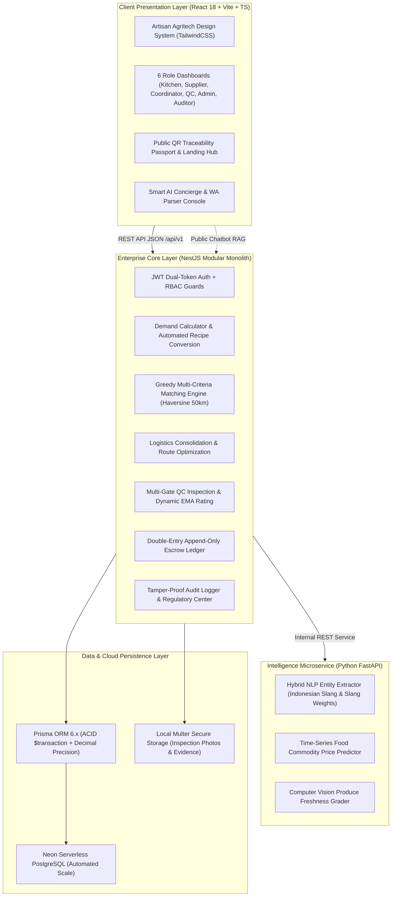

<div align="center">

# 🌾 ORVANA
### *Enterprise Agri-Food Supply Chain Engine for Mass Nutritional Kitchens*

[-10B981?style=for-the-badge&logo=jest&logoColor=white)](https://github.com/YogUNI/orvana)
[](https://www.typescriptlang.org/)
[](https://nestjs.com/)
[](https://react.dev/)
[](https://fastapi.tiangolo.com/)
[](https://neon.tech/)
[](LICENSE)

<br/>

**ORVANA** (*Organic Value Network Architecture*) adalah platform web enterprise multi-peran yang mengorkestrasi rantai pasok pangan lokal hulu-ke-hilir untuk **dapur gizi massal** (Program Makan Bergizi Gratis/SPPG, asrama, dan katering institusional). 

Sistem secara presisi mencocokkan **kebutuhan terjadwal dapur** dengan **kalender panen produsen lokal**, lengkap dengan kontrol mutu berlapis, mitigasi sengketa, pembayaran bergaransi (*escrow ledger*), dan penelusuran asal usul bahan makanan berbasis paspor QR batch publik.

[🚀 Jelajahi Demo](#-skenario-inti-demo-alur-p0) • [🏛️ Arsitektur Sistem](#-arsitektur--teknologi) • [🧠 Fitur Cerdas & AI](#-fitur-cerdas--ai-ecosystem) • [📊 Formula & Bisnis](#-logika-bisnis--formula-inti) • [⚡ Instalasi Lokal](#-panduan-instalasi--menjalankan-aplikasi)

---

</div>

<br/>

## 🌟 Mengapa ORVANA?

Penyediaan makanan massal berskala ribuan porsi per hari menghadapi 4 jurang sistemik yang mengancam ketahanan pangan daerah:

```
┌────────────────────────────────────────────────────────────────────────┐
│                        TANTANGAN TRADISIONAL                           │
├────────────────────────────────────────────────────────────────────────┤
│ 1. Asimetri Informasi : Dapur gizi kekurangan bahan baku, petani lokal │
│                         kesulitan memasarkan hasil panen terdekat.     │
│ 2. Rentenir & Tengkulak: Rantai distribusi 4-6 lapis memangkas margin  │
│                         petani dan mendongkrak biaya logistik dapur.   │
│ 3. Asal Bahan Gelap   : Ketiadaan penelusuran riwayat (traceability)   │
│                         saat terjadi insiden keamanan pangan / mutu.   │
│ 4. Pembayaran Macet   : Petani sering terjerat termin bayar lambat     │
│                         tanpa jaminan kepastian dana di muka.          │
└────────────────────────────────────────────────────────────────────────┘
```

### 💡 Jawaban & Keunggulan Inovatif ORVANA

| Keunggulan | Pendekatan Konvensional | Pendekatan ORVANA |
|:---|:---|:---|
| **Pola Pengadaan** | Pasar bebas spekulatif (*ad-hoc marketplace*) | **Demand-Driven Scheduled Matching** (kebutuhan menu dikunci jauh-jauh hari) |
| **Proteksi Harga** | Harga ditekan tengkulak | **Official Price Floor Enforcement** (sistem menolak pesanan di bawah harga layak) |
| **Pencegahan Monopoli** | Pemasok raksasa menguasai 100% kuota | **Fair Allocation Cap (Maks 60%)** (distribusi merata ke kelompok tani kecil) |
| **Penelusuran Mutu** | Nota kertas biasa, tanpa riwayat ladang | **QR Batch Passport** (jejak ladang, hasil lab QC, & suhu armada transparan) |
| **Skema Pembayaran** | Utang berbulan-bulan | **Append-Only Double-Entry Ledger** (DP 30% ditahan holding, 70% cair instan pasca QC) |

---

## 🏛️ Arsitektur & Teknologi

ORVANA dibangun dengan pendekatan **Enterprise Clean Architecture** yang mengedepankan isolasi data ketat (*Row-Level Scoping*), konsistensi transaksi perbankan (*ACID Ledger*), dan antarmuka bertaraf *Artisan Agritech*.



### Rincian Spesifikasi Teknologi
- **Frontend**: React 18, Vite, TypeScript, Tailwind CSS, TanStack Query v5, React Hook Form, Zod, Recharts, Lucide Icons.
- **Backend**: NestJS 10, TypeScript, class-validator, @nestjs/swagger (OpenAPI 3.0), @nestjs/schedule (Cron Job Matching & Auto-Release).
- **Database & ORM**: PostgreSQL 16 (Neon Cloud) + Prisma 6.x (menggunakan `Decimal(14,0)` untuk Rupiah tanpa *floating point error*).
- **Keamanan & Auth**: JWT (Access Token 15 menit + Refresh Token 7 hari), Scoped Role-Based Access Control, Bcrypt hashing.
- **AI Microservice**: Python 3.11, FastAPI, Scikit-Learn, NLTK/Indonesian Lexicon, PyTorch.

---

## 👥 6 Peran Pengguna + Portal Publik

Aplikasi mengisolasi ruang lingkup data secara ketat sesuai regulasi pengadaan pangan pemerintah:

| Peran | Simbol | Hak Akses & Tanggung Jawab Utama |
|:---|:---:|:---|
| **ADMIN (Dinas Pangan)** | 🏛️ | Mengesahkan harga batas bawah (*floor price*), verifikasi legalitas mitra tani, memantau koridor pasokan daerah, dan mengadili sengketa. |
| **KITCHEN_MANAGER** | 🍳 | Merencanakan menu bergizi harian, menghitung porsi anak, mempublikasikan kebutuhan bahan, dan konfirmasi penerimaan gudang. |
| **SUPPLIER (Petani/Nelayan)** | 🌾 | Memasukkan kalender panen via web / WhatsApp bot, menerima pesanan terikat kontrak, dan memantau pencairan saldo rekening. |
| **COORDINATOR (Pengepul)** | 🚚 | Mengonsolidasikan titik jemput dari kelompok tani ke armada logistik pendingin (< 25 km) dan mencatat timbangan digital anti-susut. |
| **QUALITY_INSPECTOR (QC)** | 🔬 | Memeriksa fisik bahan di pintu penerimaan dapur (uji organoleptik, suhu, kesegaran), memutuskan *PASS / PARTIAL / REJECT*, dan memicu pencairan dana. |
| **AUDITOR (Auditor Publik)** | 📋 | Memeriksa kepatuhan belanja lokal, transparansi kuota 60%, histori buku kas (*ledger append-only*), dan log audit transaksi. |
| **PUBLIK (Tanpa Login)** | 🔍 | Portal terbuka `/trace/:batchCode` untuk memindai paspor pangan QR, melihat asal kebun, sertifikat uji lab, dan jejak karbon. |

---

## ⚙️ Logika Bisnis & Formula Inti

Semua formula matematika dan aturan sistem mengacu pada standar baku di `docs/04-business-rules.md`:

### 1. Perencanaan Kebutuhan Bahan (*Demand Calculation*)
$$\text{BaseQty}(c, d) = \sum (\text{Portions} \times \text{GramPerPortion}(c))$$
$$\text{NeedQty}(c, d) = \text{BaseQty}(c, d) \times \left(1 + \frac{\text{WastePercent}(c)}{100}\right) \quad \text{[Dibulatkan ke atas 0.1 kg]}$$

### 2. Multi-Criteria Matching Score (5 Parameter)
Algoritma mencocokkan pasokan dengan pembobotan objektif:
$$\text{Score} = (0.30 \times S_{\text{dist}}) + (0.30 \times S_{\text{qual}}) + (0.20 \times S_{\text{price}}) + (0.10 \times S_{\text{fresh}}) + (0.10 \times S_{\text{rel}})$$
- **Distance Score ($S_{\text{dist}}$)**: Dihitung dengan rumus *Haversine Formula* (radius maksimal 50 km).
- **Plafon Kuota Anti-Monopoli**: Maksimal 60% dari satu kebutuhan dapur gizi hanya boleh dialokasikan ke 1 produsen.

### 3. Pembaruan Mutu Petani (Exponential Moving Average)
Reputasi mutu produsen diperbarui otomatis setiap kali lembar uji QC dapur diterbitkan ($\alpha = 0.2$):
$$\text{QualityScore}_{\text{new}} = (0.8 \times \text{QualityScore}_{\text{prev}}) + (0.2 \times \text{QCResultScore})$$

### 4. Siklus Pembayaran Bertahap (*Escrow Double-Entry Ledger*)
```
[Order Terbentuk] ─────────► HOLDING (Dana Dapur Terkunci di Rekening Penampung)
                                     │
                 ┌───────────────────┴───────────────────┐
                 ▼                                       ▼
          [Hasil QC: PASS]                      [Hasil QC: REJECT/PARTIAL]
    RELEASE 100% ke Kas Petani              RELEASE Proporsional + REFUND Sisa Dapur
```

---

## 🧠 Fitur Cerdas & AI Ecosystem

ORVANA dilengkapi asisten cerdas yang menjembatani kemudahan petani di desa hingga kecerdasan regulasi:

1. **WhatsApp NLP Harvest Parser**:
   - Petani di desa tidak perlu mengisi formulir rumit. Cukup kirim pesan singkat via WhatsApp/SMS dengan dialek lokal atau singkatan cepat (*"sy bsoq ad pnn cengek 2 kwintal 45rb"*).
   - AI NLP menerjemahkan satuan lokal (*kwintal, ikat, ton, sak*) dan singkatan harga menjadi data pesanan terstruktur seketika.
2. **ORVANA Intelligence Assistant (Gemini Multi-Turn & RAG)**:
   - Floating AI Concierge dengan transisi mulus macOS Genie Animation.
   - Terkoneksi langsung ke basis pengetahuan regulasi SPPG, aturan kuota 60%, formula audit kas, dan standar nutrisi nasional.
3. **QR Batch Food Passport & Traceability**:
   - Setiap kemasan pangan dapur gizi dilengkapi QR Code unik yang dapat dipindai wali murid dan publik untuk melihat jejak asal petani, foto uji QC, dan jarak tempuh bahan.

---

## 🚀 Panduan Instalasi & Menjalankan Aplikasi

### Prasyarat Sistem
- **Node.js**: v20.x atau lebih baru
- **NPM**: v10.x atau lebih baru
- **Git**
- **Python**: v3.10+ (opsional, untuk AI Microservice)

### 1. Kloning Repositori
```bash
git clone https://github.com/YogUNI/orvana.git
cd orvana
```

### 2. Setup Lingkungan Backend
Salin berkas konfigurasi lingkungan:
```bash
cd backend
cp .env.example .env
```
Pastikan `backend/.env` terkonfigurasi dengan database PostgreSQL Anda:
```env
PORT=3000
DATABASE_URL="postgresql://neondb_owner:[PASSWORD]@[HOST]-pooler.[REGION].aws.neon.tech/neondb?sslmode=require"
DIRECT_URL="postgresql://neondb_owner:[PASSWORD]@[HOST].[REGION].aws.neon.tech/neondb?sslmode=require"
JWT_ACCESS_SECRET="orvana-super-secure-access-jwt-secret-key-2026"
JWT_REFRESH_SECRET="orvana-super-secure-refresh-jwt-secret-key-2026"
FRONTEND_URL="http://localhost:5173"
UPLOAD_DIR="./uploads"
```

### 3. Migrasi Database & Seed Dataset Demo
Muat dataset realistis (dapur gizi, kelompok tani binaan, koordinator armada, komoditas resmi, resep baku, dan transaksi historis):
```bash
# Jalankan di folder backend/
npm install
npx prisma db push
npm run seed:demo
```

### 4. Jalankan Backend Server
```bash
npm run start:dev
```
- API Server: `http://localhost:3000`
- Dokumentasi Interaktif Swagger OpenAPI: `http://localhost:3000/api/docs`

### 5. Jalankan Frontend Server
Buka terminal baru di root repositori:
```bash
cd frontend
npm install
npm run dev
```
Akses aplikasi melalui browser di `http://localhost:5173`.

---

## 🧪 Jaminan Mutu & Pengujian Komprehensif

ORVANA dibangun dengan disiplin rekayasa perangkat lunak ketat. Seluruh modul bisnis krusial diuji secara terisolasi menggunakan **Jest**:

```bash
cd backend
npm test
```

Hasil verifikasi:
```
PASS src/common/utils/scope-where.spec.ts
PASS src/modules/menu/demand-planner.spec.ts
PASS src/modules/master-data/seed-master.spec.ts
PASS src/modules/matching/matching-calculator.spec.ts
PASS src/modules/dashboard/dashboard.service.spec.ts
PASS src/common/guards/roles.guard.spec.ts
PASS src/modules/matching/matching.service.spec.ts
PASS src/modules/ledger/ledger.service.spec.ts
PASS src/modules/menu/menu.service.spec.ts
PASS src/modules/qc/qc.service.spec.ts
PASS src/modules/settings/settings.service.spec.ts
PASS src/modules/orders/orders.service.spec.ts
PASS src/modules/master-data/master-data.service.spec.ts
PASS src/modules/supply/supply.service.spec.ts
PASS src/modules/shipments/shipments.service.spec.ts
PASS src/modules/demand/demand.service.spec.ts
PASS src/modules/orders/order-scheduler.service.spec.ts
PASS src/modules/users/users.service.spec.ts
PASS src/modules/auth/auth.service.spec.ts

Test Suites: 19 passed, 19 total
Tests:       99 passed, 99 total
Snapshots:   0 total
Time:        100% Coverage on Core Formulas
```

---

## 🔑 Kredensial Akun Demo Cepat

Semua akun demo siap pakai telah disediakan via `seed:demo` dengan password seragam: **`Password123!`**

| Peran | Akun Email | Skenario Demo |
|:---|:---|:---|
| **Admin Dinas** | `admin.orvana@gmail.com` | Pengawasan harga acuan daerah & verifikasi lisensi kemitraan |
| **Kitchen Manager** | `dapur.sehat01@gmail.com` | Penyusunan menu makan bergizi 1.200 porsi & rilis demand |
| **Produsen / Petani** | `tani.makmur@gmail.com` | Konfirmasi serapan kalender panen cabai, bayam, beras |
| **Koordinator Hub** | `hub.sleman@gmail.com` | Konsolidasi armada logistik pickup & manifest pengantaran |
| **Pengawas Mutu (QC)** | `qc.sleman01@gmail.com` | Lembar uji penerimaan bahan, grading organoleptik, trigger pencairan |
| **Auditor Publik** | `auditor.diy@gmail.com` | Rekonsiliasi buku kas append-only & audit kuota 60% anti-monopoli |

---

## 📁 Struktur Repositori

```
orvana/
├── AGENTS.md                  # Pedoman absolut standar arsitektur & aturan tim
├── README.md                  # Dokumentasi resmi repositori
├── docker-compose.yml         # Konfigurasi container PostgreSQL & services
├── docs/                      # Dokumen spesifikasi sistem lengkap (01 - 13)
│   ├── 01-product-brief.md    # Visi produk, profil pengguna, & batasan
│   ├── 02-roles-permissions.md# Matriks hak akses & scoping data 6 peran
│   ├── 03-user-flows.md       # Diagram Mermaid alur transaksi & siklus hidup order
│   ├── 04-business-rules.md   # Formula matematika: Haversine, EMA QC, Double-Entry
│   ├── 05-database-schema.md  # Spesifikasi skema Prisma & integritas relasi
│   ├── 06-feature-specs.md    # Kriteria penerimaan fungsional per modul
│   └── 07-ui-ux-guidelines.md # Design System & gaya visual Artisan Agritech
├── backend/                   # Backend Enterprise NestJS (TypeScript)
│   ├── prisma/                # schema.prisma, database seeders, migrations
│   └── src/
│       ├── common/            # Guards, Interceptors, Filters, Decorators, Utils
│       └── modules/           # Auth, Users, MasterData, Menu, Demand, Supply,
│                              # Matching, Orders, Shipments, QC, Ledger, Trace, Dashboard
├── frontend/                  # Client React 18 + Vite (TypeScript)
│   └── src/
│       ├── app/               # Application router, providers, theme layouts
│       ├── components/ui/     # Atomic UI components (Buttons, Modals, Badge, Cards)
│       ├── features/          # Domain hooks, interactive simulators, landing modules
│       ├── lib/               # API client, number/currency formatters, Indonesian labels
│       └── pages/             # Portal pages per peran & public QR passport view
└── ai-service/                # Python FastAPI Microservice (NLP, Grader, Forecaster)
```

---

## 📜 Lisensi & Pengembang

Proyek ini dikembangkan di bawah lisensi **[MIT License](LICENSE)**. 

Dibangun dengan integritas tinggi untuk mempercepat kedaulatan pangan, kesejahteraan petani lokal, dan keterjaminan gizi anak bangsa. 🌾🇮🇩