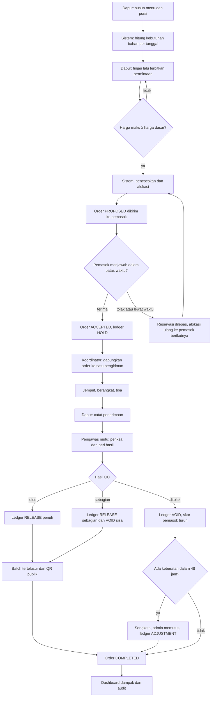
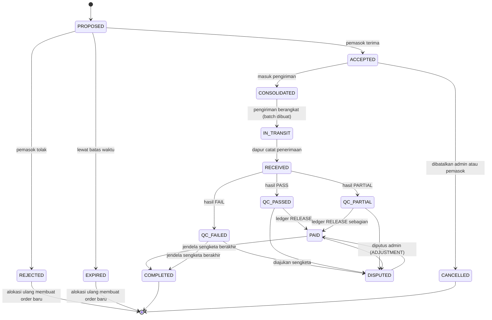
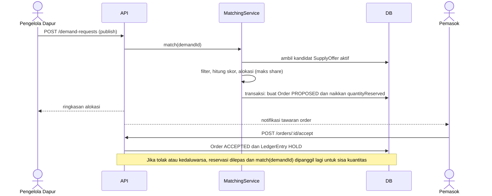
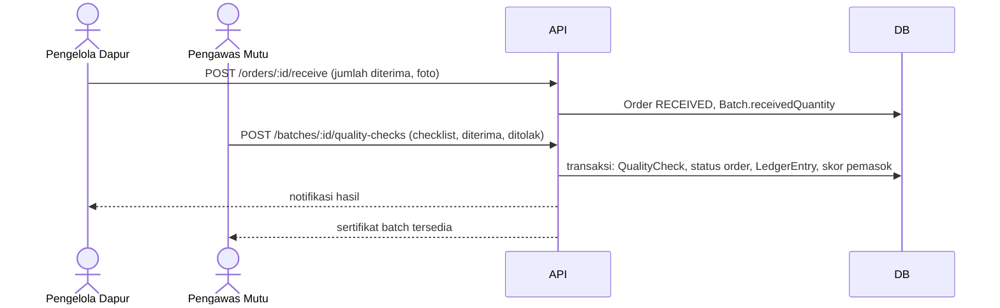

# 03. Alur Pengguna dan Siklus Status

Diagram memakai Mermaid (dapat dirender di GitHub, VS Code, dan banyak IDE).

## 1. Alur end-to-end

## 2. Siklus status order

Pemetaan istilah ke bahasa Indonesia: PROPOSED = Ditawarkan, ACCEPTED = Disanggupi, CONSOLIDATED = Dikonsolidasi,
IN_TRANSIT = Dikirim, RECEIVED = Diterima, QC_PASSED = Lolos mutu, QC_PARTIAL = Lolos sebagian,
QC_FAILED = Ditolak/Retur, DISPUTED = Sengketa, PAID = Dibayar, COMPLETED = Selesai.

Aturan transisi ditegakkan di `OrdersService.transition(orderId, to, actor)`. Transisi di luar tabel di atas ditolak dengan kode `INVALID_TRANSITION`.
Setiap transisi menulis `AuditLog`.

## 3. Status permintaan (DemandRequest)

`DRAFT` → `OPEN` (diterbitkan, pencocokan berjalan) → `MATCHING` (ada order PROPOSED) → `PARTIALLY_FULFILLED` atau `FULFILLED`
(sesuai total kuantitas order yang sudah ACCEPTED atau lebih lanjut) → atau `CANCELLED`.

## 4. Status pengiriman

`PLANNED` → `PICKING_UP` → `IN_TRANSIT` → `ARRIVED` (atau `CANCELLED` sebelum IN_TRANSIT).
- `PLANNED`: order menjadi CONSOLIDATED.
- `IN_TRANSIT`: batch dibuat untuk tiap order; order menjadi IN_TRANSIT.
- `ARRIVED`: koordinator mengisi susut (jika ada); dapur kemudian mencatat penerimaan per order.

## 5. Sequence: pencocokan dan alokasi

## 6. Sequence: penerimaan, QC, dan pembayaran

## 7. Alur per peran (ringkas)

**Pengelola dapur:** daftar → diverifikasi → buat menu mingguan → lihat kebutuhan → terbitkan permintaan → pantau order → terima barang → (opsional) ulas pemasok → ajukan sengketa bila perlu.

**Pemasok:** daftar → diverifikasi → isi profil dan lokasi → isi rencana panen dan stok → terima notifikasi order → terima/tolak (dalam 12 jam) → serahkan ke titik kumpul → pantau pembayaran dan skor.

**Koordinator:** lihat order siap kirim → pilih order (dapur dan tanggal sama) → buat pengiriman → ubah status (jemput, berangkat, tiba) → catat susut dan biaya angkut.

**Pengawas mutu:** lihat antrean batch → isi checklist dan jumlah diterima/ditolak → terbitkan hasil → beri umpan balik pemasok.

**Admin:** verifikasi akun → atur data master, harga acuan, dan parameter → pantau dashboard → putuskan sengketa → telusuri audit.

**Auditor/publik:** buka dashboard dampak → telusuri batch via QR atau kode → lihat ringkasan ledger teranonimkan.

## 8. Kasus tepi yang harus ditangani

| Situasi | Perilaku yang diharapkan |
|---|---|
| Tidak ada kandidat pemasok | Permintaan tetap `OPEN`, dapur dan admin diberi notifikasi "pasokan belum tersedia" |
| Pasokan kurang dari kebutuhan | Order dibuat untuk yang tersedia, permintaan `PARTIALLY_FULFILLED` dengan sisa kuantitas ditampilkan |
| Pemasok menolak/kedaluwarsa | Reservasi dilepas, pemasok itu dikecualikan untuk permintaan tersebut, alokasi ulang untuk sisa |
| Stok pemasok berubah saat ada order PROPOSED | Tidak boleh mengurangi stok di bawah `quantityReserved` |
| Dapur membatalkan permintaan yang sudah punya order | Hanya jika semua order masih PROPOSED/ACCEPTED; order dibatalkan dan reservasi dilepas; pemasok diberi tahu |
| Jumlah diterima berbeda lebih dari 2 persen dari dikirim | Ditandai "selisih" dan wajib diberi catatan |
| QC dikirim dua kali | Ditolak (satu QC final per batch); koreksi lewat sengketa admin |
| Dua koordinator memilih order yang sama | Transaksi dengan pemeriksaan status; yang kedua mendapat `ORDER_ALREADY_CONSOLIDATED` |
