# 12. Audit Kualitas Sistem & Rencana Aksi Masa Depan (Enterprise Roadmap)

> Dokumen ini memuat hasil audit menyeluruh mutu sistem (Frontend, Backend, Database, dan Alur Bisnis)
> serta rencana aksi bertahap untuk pengembangan masa depan menuju platform produksi skala nasional.

---

## 1. Ringkasan Eksekutif & Status Sistem Saat Ini

Per Oktober 2026, **ORVANA** telah menyelesaikan fondasi P0 dan P1 sesuai seluruh kriteria penerimaan `06-feature-specs.md` dan alur `03-user-flows.md`:
* **Kesiapan Uji Backend:** 23 Test Suites / 122 Tests Passed (`npm test` 100% hijau).
* **Kesiapan Frontend:** TypeScript strict mode, build bundle produksi Vite lulus bersih tanpa galat.
* **Integritas Alur End-to-End:** Simulasi siklus nyata multi-peran (Petani ➔ Dapur ➔ Koordinator ➔ Pengawas Mutu ➔ Publik/Auditor) telah terverifikasi sukses dengan data konkret.

---

## 2. Hasil Audit Mendalam (Analisis Kelebihan & Kekurangan)

### 2.1 Lapisan Basis Data (PostgreSQL + Prisma 6)
* **Kelebihan:**
  * Skema relasi telah mencakup seluruh kebutuhan domain inti: Permintaan, Pasokan, Logistik, QC, Ledger Transparansi, Sengketa, Notifikasi, dan Audit Log.
  * Integritas data terjaga dengan transaksi atomik (`prisma.$transaction`) pada operasi kritis (pencocokan alokasi, penerimaan gudang, dan pencairan buku besar).
* **Area Peningkatan (Kekurangan Saat Ini):**
  1. **Mutasi Persediaan Belum Terjurnal Terpisah:** Pengurangan dan penambahan stok di `SupplyOffer` langsung memperbarui kolom `quantityAvailable` dan `quantityReserved`. Belum ada tabel `InventoryTransaction` (Buku Mutasi Stok) untuk audit forensik riwayat perubahan stok petani.
  2. **Hierarki Zonasi Masih Tunggal:** Entitas wilayah (`Region`) saat ini masih berupa tabel datar (*flat*). Belum mendukung pengelompokan hierarkis desa/kecamatan/kabupaten dinamis.
  3. **Hash Chaining Belum Tersedia:** Baris entri `LedgerEntry` belum dilengkapi penandatanganan kriptografis rantai hash (*SHA-256 chaining*) untuk jaminan anti-tamper tingkat institusi keuangan.

### 2.2 Lapisan Backend & Logika Bisnis (NestJS)
* **Kelebihan:**
  * Otentikasi JWT (access 15m + refresh 7d), pembatasan laju (*rate limiting*), dan otorisasi berbasis peran (`RolesGuard`) terpasang di semua endpoint privat.
  * Logika bisnis pencocokan (*matching engine*), penentuan skor mutu, dan pemotongan susut bobot logistik teruji dengan vektor data konkret `09-seed-data.md`.
* **Area Peningkatan (Kekurangan Saat Ini):**
  1. **Umpan Balik Diagnosa Matching Kurang Informatif:** Jika pencocokan menghasilkan 0 kandidat, API hanya mengembalikan array kosong tanpa rincian alasan kegagalan (apakah karena harga di atas pagu, masa simpan terlampaui, atau jarak melebihi radius).
  2. **Scheduler Masih Berbasis In-Memory:** Penanganan tugas latar belakang (kedaluwarsa tawaran dan penyelesaian pesanan) menggunakan `@nestjs/schedule`. Jika server direstart, antrean belum persisten via Redis/BullMQ.
  3. **Penyimpanan Berkas Masih Bersifat Lokal:** Unggahan bukti serah terima dan foto mutu disimpan di direktori server lokal `backend/uploads/`, belum terintegrasi dengan adapter penyimpanan cloud (*S3 / Cloud Storage*).

### 2.3 Lapisan Frontend & Pengalaman Pengguna (React + TypeScript)
* **Kelebihan:**
  * Tampilan responsif mobile (lebar 375 px) untuk peran lapangan (Petani, Koordinator, Inspektur Mutu).
  * Validasi formulir menggunakan React Hook Form + Zod dengan pesan kesalahan ramah pengguna berbahasa Indonesia.
  * Modul halaman terspesialisasi per peran dengan layout sidebar dan navigasi bawah mobile.
* **Area Peningkatan (Kekurangan Saat Ini):**
  1. **Pembaruan Antar-Peran Belum Real-Time (WebPush/WebSocket):** Pengguna masih perlu memuat ulang (*refresh*) halaman atau menunggu interval polling berkala untuk melihat pesanan atau pengiriman baru yang masuk.
  2. **Kurangnya Petunjuk Kontekstual Form (Smart Hints):** Pada form pendaftaran panen petani dan penerimaan dapur, belum ada indikator visual langsung mengenai batas masa simpan (*shelf-life*) komoditas yang dipilih.
  3. **Optimalisasi Rute Peta Koordinator:** Peta Leaflet koordinator saat ini menampilkan pin lokasi, namun belum menggambarkan visualisasi jalur multi-titik (*multi-stop polyline*) penjemputan dari beberapa desa.

---

## 3. Rencana Aksi Implementasi Masa Depan (4 Pilar Strategis)

```mermaid
flowchart TD
    P1["Pilar 1: User Experience & Real-time Flow"] --> M1["Smart Matching Diagnostics"]
    P1 --> M2["WebSocket / SSE Real-time Alerts"]
    P1 --> M3["Guided Stepper & Smart Hints"]
    
    P2["Pilar 2: Penguatan Logika & Transparansi"] --> M4["Inventory Ledger (Mutasi Stok)"]
    P2 --> M5["Multi-Stop Route Polyline Map"]
    P2 --> M6["QR & PDF Batch Digital Stamping"]
    
    P3["Pilar 3: Reliabilitas & Task Queue"] --> M7["Redis / BullMQ Background Engine"]
    P3 --> M8["Cloud Storage Adapter (S3/GCS)"]
    P3 --> M9["Ledger Hash Integrity Chaining"]
    
    P4["Pilar 4: Analitik & Kesiapan Skala"] --> M10["Stress-Testing Concurrency (k6)"]
    P4 --> M11["Regional Harvest Forecasting Dashboard"]
```

### Pilar 1: User Experience & Real-Time Flow
- [x] **P1.1: Diagnosa Pintar Pencocokan Kebutuhan (Smart Matching Diagnostics):**
  - Backend mengembalikan objek rincian alasan kandidat tereliminasi (harga di atas pagu, melewati batas kesegaran, atau jarak di luar radius).
  - Frontend menampilkan banner diagnosa edukatif saat 0 kandidat ditemukan pada halaman detail kebutuhan dapur.
- [ ] **P1.2: Notifikasi Instan Real-Time (WebSocket / SSE):**
  - Implementasi WebSocket Gateway di NestJS untuk memperbarui kartu pesanan petani dan pengiriman koordinator secara langsung tanpa refresh halaman.
- [x] **P1.3: Formulir Interaktif & Petunjuk Kesegaran Pangan:**
  - Tambahkan tooltip dan badge otomatis di form penawaran stok petani yang menampilkan batas toleransi simpan komoditas yang dipilih.

### Pilar 2: Penguatan Logika Bisnis & Transparansi
- [x] **P2.1: Buku Mutasi Persediaan (Inventory Ledger):**
  - Tambahkan pencatatan dan visualisasi buku mutasi stok petani (debit/kredit kg, reservasi order, dan pelepasan alokasi).
- [x] **P2.2: Visualisasi Rute Penjemputan Logistik Dinamis:**
  - Integrasikan rendering jalur multi-stop polyline di react-leaflet pada dasbor koordinator untuk memetakan alur armada jemput.
- [x] **P2.3: Stempel Sertifikat Digital Batch & Verifikasi Publik:**
  - Lengkapi sertifikat PDF mutu batch dengan stempel digital dan tautan penelusuran publik yang dapat diverifikasi instan via kamera gawai.

### Pilar 3: Reliabilitas Sistem & Antrean Tugas (Queue)
- [ ] **P3.1: Antrean Tugas Terdistribusi (BullMQ + Redis):**
  - Migrasi cron job kedaluwarsa pesanan dan kalkulasi rekapitulasi ke antrean BullMQ agar tahan gangguan restart server.
- [ ] **P3.2: Adapter Media Terpadu (Storage Service):**
  - Siapkan interface adapter media (Local Disk untuk pengembangan, S3/Cloud Bucket untuk server produksi).
- [ ] **P3.3: Verifikasi Rantai Kriptografis Buku Besar (Ledger Chaining):**
  - Tambahkan kolom `previousHash` dan `entryHash` pada tabel `LedgerEntry` untuk memastikan integritas buku besar bebas manipulasi.

### Pilar 4: Analisis Ketahanan & Kesiapan Skala Massal
- [ ] **P4.1: Pengujian Beban Konkurensi Tinggi (Load Testing):**
  - Skenario pengujian beban 500 pengguna simultan menggunakan k6 untuk memvalidasi performa penguncian alokasi pesanan di PostgreSQL.
- [ ] **P4.2: Dasbor Prediksi Keseimbangan Pasokan Daerah:**
  - Menampilkan grafik proyeksi surplus/defisit pangan 14 hari ke depan bagi Admin Dinas Ketahanan Pangan berdasarkan rencana panen kolektif.
